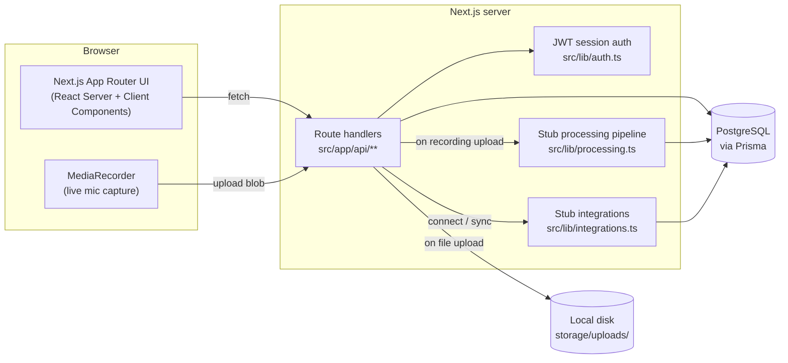

# Briefly

**A meeting intelligence platform** — record or upload a meeting and get a
speaker-labeled transcript, a structured summary, tracked action items, and a
searchable history, all in one place.


---

## Contents

- [Features](#features)
- [What's real vs. stubbed](#whats-real-vs-stubbed)
- [Architecture](#architecture)
- [Tech stack](#tech-stack)
- [Getting started](#getting-started)
- [Environment variables](#environment-variables)
- [Project layout](#project-layout)
- [Roadmap](#roadmap)
- [License](#license)

## Features

- **Meetings** — schedule ahead or start instantly, invite participants, join
  any meeting with a short share code
- **Recording** — upload an audio/video file, or record live from the
  browser's microphone
- **Transcript & timeline** — a speaker-labeled, timestamped transcript;
  rename speakers inline; star any line as a timeline highlight
- **Structured summaries** — Overview, Key Decisions, Open Questions, and
  Next Steps, editable by hand
- **Action items** — owners, due dates, status tracking, and a cross-meeting
  Tasks dashboard
- **Decision log** — every key decision across every meeting, in one feed
- **Search** — find meetings and transcript mentions by keyword
- **Integrations** — connect Google Calendar, Slack, Notion, Jira, and Linear;
  share recaps and push follow-up tasks with one click
- **Dashboards** — meeting history, upcoming schedule, open/overdue tasks

## What's real vs. stubbed

Everything above is fully built and usable **except** the parts that need an
LLM, which are intentionally deferred for a later pass:

| Area | Status |
| --- | --- |
| Auth, teams, meetings, participants, join-by-code | ✅ Real |
| Recording upload + live browser mic recording | ✅ Real |
| Transcript viewer, speaker renaming, timeline highlights | ✅ Real |
| Action items (CRUD, owners, due dates, status) | ✅ Real |
| Dashboards (meetings, tasks, decision log) | ✅ Real |
| Keyword search over titles/summaries/transcripts | ✅ Real (SQL `ILIKE`) |
| Integration connections, activity log, trigger points | ✅ Real framework, **simulated** external calls |
| Speech-to-text + speaker diarization | 🧪 Stub — deterministic placeholder transcript |
| Summarization + action-item extraction | 🧪 Stub — deterministic placeholder content |
| Natural-language / semantic search, contextual Q&A | ⏳ Not built yet |

Stubbed logic lives in `src/lib/processing.ts` (transcription, diarization,
summarization, action-item extraction) and `src/lib/integrations.ts`
(outbound calls to providers). Both are commented with exactly what to
replace when the LLM work starts — the database schema, API routes, and UI
don't need to change.

## Architecture



Everything is one Next.js app: the App Router serves both the UI (server +
client components) and the backend (route handlers under `src/app/api`).
There's no separate backend service — Prisma talks to Postgres directly from
route handlers, and uploaded recordings are streamed to local disk and served
back through an authenticated route.

## Tech stack

- **Framework:** Next.js 16 (App Router, TypeScript, Turbopack)
- **Database:** PostgreSQL via Prisma 7 (driver adapter: `@prisma/adapter-pg`)
- **Styling:** Tailwind CSS 4
- **Auth:** JWT session cookies (`jose` + `bcryptjs`) — no third-party auth
  provider
- **Storage:** local disk for recordings (git-ignored), served through an
  authenticated route

## Getting started

**Prerequisites:** Node.js 20+, Docker (for Postgres), npm.

```bash
git clone https://github.com/ancypatel-21/briefly.git
cd briefly
npm install

cp .env.example .env         # fill in AUTH_SECRET (see below)
docker compose up -d         # starts Postgres on localhost:5433
npm run db:migrate           # applies the schema
npm run db:seed              # creates a demo workspace + one processed meeting
npm run dev
```

Open http://localhost:3000 and sign in with the seeded demo account:

- **Email:** `demo@briefly.app`
- **Password:** `password123`

Or register a fresh workspace from the sign-up page.

### Environment variables

See `.env.example` for the full template.

- `DATABASE_URL` — Postgres connection string (matches `docker-compose.yml`)
- `AUTH_SECRET` — signs session JWTs; generate one with
  `openssl rand -base64 32`
- `ANTHROPIC_API_KEY` — **not used yet.** Reserved for when the LLM-powered
  features (real summarization, action-item extraction, natural-language
  search, contextual Q&A — see `src/lib/processing.ts`) get implemented
  against the Claude API. Get a key at https://console.anthropic.com/ when
  that work starts.

### Useful scripts

| Script | Purpose |
| --- | --- |
| `npm run dev` | Start the dev server |
| `npm run build` / `npm run start` | Production build / serve |
| `npm run lint` | ESLint |
| `npm run db:migrate` | Create/apply a migration after editing `prisma/schema.prisma` |
| `npm run db:seed` | Seed a demo workspace (no-ops if it already exists) |
| `npm run db:studio` | Prisma Studio — a GUI over the database |

## Project layout

```
prisma/schema.prisma        Data model (see comments for what's LLM-adjacent)
prisma/seed.ts              Demo workspace + one fully processed meeting
src/lib/processing.ts       Stub transcription/diarization/summary pipeline
src/lib/integrations.ts     Stub outbound integration calls
src/lib/auth.ts             Password hashing + JWT session cookies
src/app/api/**              Route handlers (the whole backend)
src/app/(auth)/**           Login / register
src/app/(app)/**            Authenticated app shell + pages
src/components/**           UI components (meeting/ has the meeting-detail tabs)
```

## Roadmap

- [ ] Real speech-to-text + speaker diarization
- [ ] LLM-generated summaries and action-item extraction (Claude API)
- [ ] Natural-language / semantic search and contextual Q&A over meeting
      history
- [ ] Real OAuth for Google Calendar, Slack, Notion, Jira, and Linear

## License

[MIT](LICENSE)
